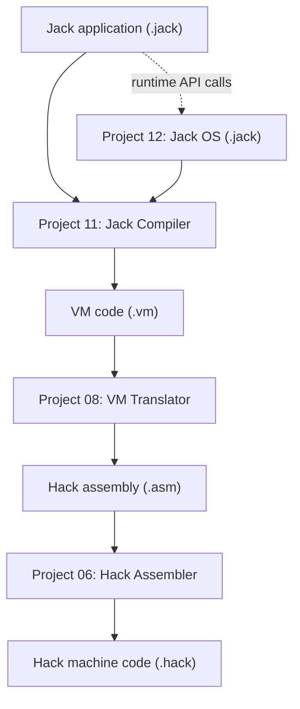
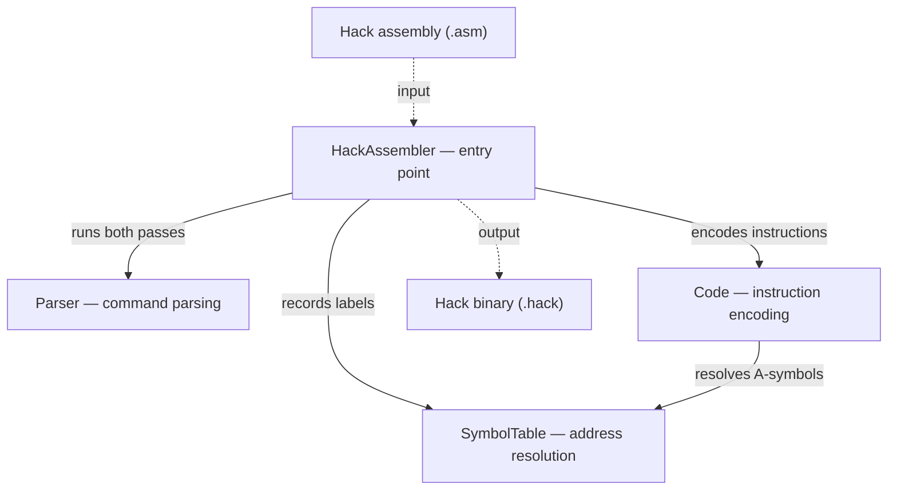
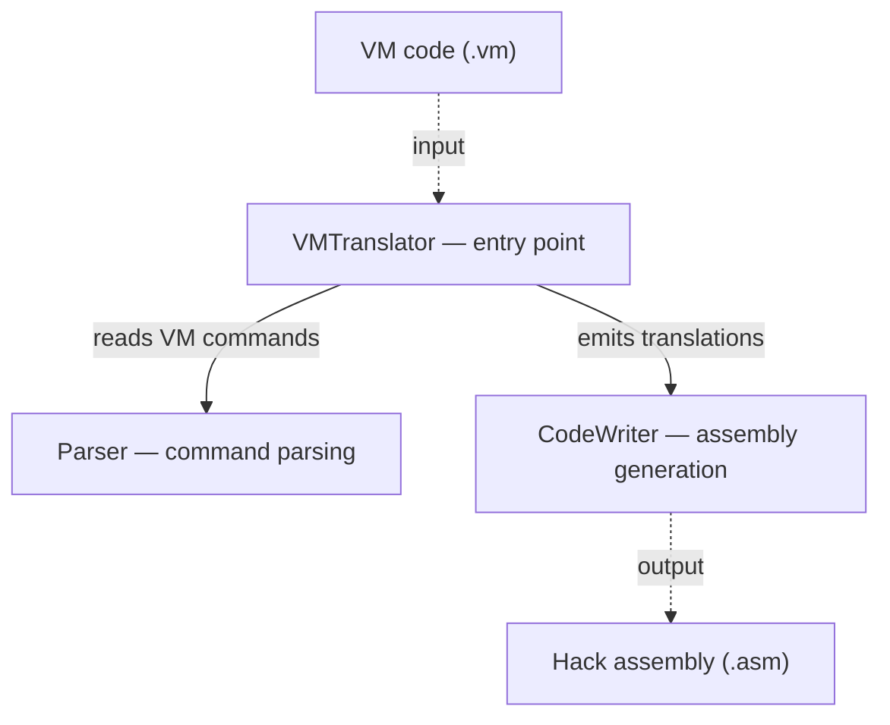
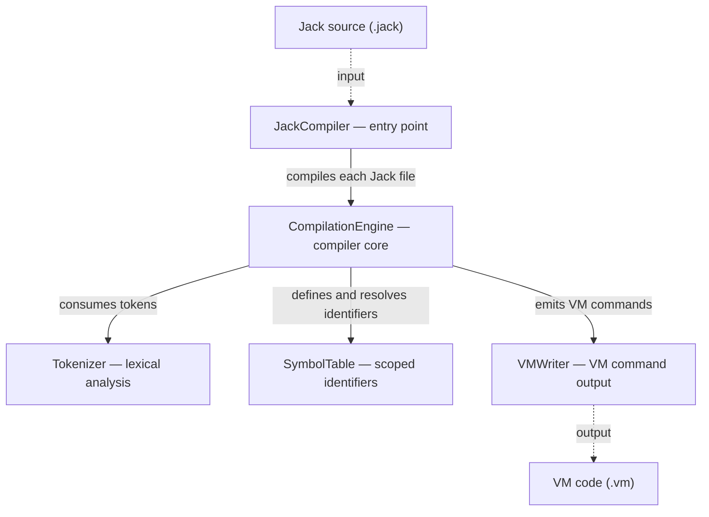

# Nand2Tetris Software Stack

## Overview

This public showcase documents four connected projects from the
[Nand2Tetris](https://www.nand2tetris.org/) curriculum. Together, they form a
complete software stack that translates a high-level Jack program into Hack
machine code and supplies the runtime services required by the compiled
program.

The showcase focuses on the software layers of the Hack platform: symbol
resolution and instruction encoding, stack-based virtual-machine translation,
recursive-descent compilation, and a small operating-system/runtime library.

## End-to-End Pipeline



Project 12 is part of this pipeline rather than a separate application. Its
Jack classes are compiled into VM code and provide memory management, arrays,
mathematics, strings, graphics, text output, keyboard input, and system services
called by Jack programs at runtime.

## Documented Projects

| Project | Language | Input → Output | Primary responsibility |
| --- | --- | --- | --- |
| Project 06 — Hack Assembler | Java | Hack assembly → Hack binary | Two-pass resolution of labels and variables, plus A- and C-instruction encoding |
| Project 08 — VM Translator | Java | VM code → Hack assembly | Stack operations, memory segments, branching, functions, calls, returns, and bootstrap code |
| Project 11 — Jack Compiler | Java | Jack source → VM code | Tokenization, parsing, scoped symbol management, and VM code generation |
| Project 12 — Jack OS | Jack | Jack OS source → VM code | Heap allocation, data types, arithmetic, graphics, text output, keyboard input, and system startup |

## Project Architecture

Solid arrows show calls or dependencies; dashed arrows show input and output
file flow.

### Project 06 — Hack Assembler



| Component | Responsibility |
| --- | --- |
| `HackAssembler.java` | Validates the `.asm` input, coordinates the two passes, and writes each translated 16-bit instruction. |
| `Parser.java` | Removes whitespace and comments, classifies A-instructions, C-instructions, and labels, and exposes their component fields. |
| `SymbolTable.java` | Initializes predefined symbols, records ROM labels, and assigns previously unseen variables consecutive RAM addresses beginning at 16. |
| `Code.java` | Validates and encodes `comp`, `dest`, and `jump` mnemonics and converts numeric or symbolic A-instruction operands into binary addresses. |

### Project 08 — VM Translator



| Component | Responsibility |
| --- | --- |
| `VMTranslator.java` | Validates a `.vm` file or directory, selects the output path, emits bootstrap code for directory translation, and coordinates every input file. |
| `Parser.java` | Removes comments and whitespace, identifies each VM command type, and exposes the command arguments. |
| `CodeWriter.java` | Emits Hack assembly for arithmetic, memory access, branching, functions, calls, returns, and bootstrap initialization while maintaining file, function, comparison-label, and return-label state. |

### Project 11 — Jack Compiler



| Component | Responsibility |
| --- | --- |
| `JackCompiler.java` | Validates one `.jack` file or a directory and creates a separate compilation engine and `.vm` output for every source file. |
| `Tokenizer.java` | Recognizes Jack keywords, symbols, identifiers, integer constants, and string constants; skips whitespace and comments; and provides one-token lookahead. |
| `CompilationEngine.java` | Performs recursive-descent parsing and direct VM generation for declarations, statements, expressions, terms, subroutine calls, arrays, constructors, and methods. |
| `SymbolTable.java` | Maintains separate class and subroutine scopes and records each identifier's name, type, kind, and index. |
| `VMWriter.java` | Centralizes output of push/pop, arithmetic, branching, function, call, and return VM commands and closes the generated file safely. |

### Project 12 — Jack OS

Project 12 consists of eight runtime modules. The dependency column describes
the main services each class calls; `Sys` initializes the complete runtime and
then transfers control to `Main.main`.

| File | Main dependencies | Runtime responsibility |
| --- | --- | --- |
| `Memory.jack` | — | Initializes the heap, manages the free list, allocates/deallocates blocks, and exposes direct RAM access |
| `Array.jack` | `Memory` | Wraps allocation and disposal for contiguous array storage |
| `String.jack` | `Array`, `Memory`, `Math` | Stores characters, tracks length, mutates string content, and converts between strings and integers |
| `Math.jack` | `Array`, `Sys` | Stores bit masks and implements multiplication, division, square root, absolute value, minimum, and maximum |
| `Screen.jack` | `Array`, `Memory`, `Math` | Converts pixel coordinates to screen-memory operations and draws pixels and filled shapes |
| `Output.jack` | `Array`, `Memory`, `Math`, `String` | Renders bitmap characters, manages the character-grid cursor, and prints characters, strings, and integers |
| `Keyboard.jack` | `Memory`, `Output`, `String` | Reads the memory-mapped keyboard and provides character, line, and integer input |
| `Sys.jack` | All runtime modules and `Main` | Initializes services in dependency order, launches the program, waits, reports errors, and halts execution |

## Implementation Highlights

### Project 06 — Two-Pass Symbol Resolution

- The parser normalizes each source line before classifying it as an
  A-instruction, C-instruction, or label declaration.
- The first pass counts only real ROM instructions and binds `(LABEL)` symbols
  to the address of the following instruction.
- The second pass resolves predefined symbols and labels, while previously
  unseen variables receive consecutive RAM addresses beginning at 16.
- C-instructions are decomposed into `comp`, `dest`, and `jump` fields and
  encoded through validated lookup tables.
- Numeric A-instructions are range-checked before conversion to a 15-bit binary
  address.

### Project 08 — VM Semantics and Function Calls

- Arithmetic and logical operations consume and produce values on the VM stack.
- Comparison commands use unique labels so that multiple `eq`, `gt`, and `lt`
  operations cannot collide in the generated assembly.
- `local`, `argument`, `this`, and `that` are translated through their base
  pointers, while `temp`, `pointer`, and `static` use their required fixed or
  namespaced locations.
- VM labels are scoped to the current function, and static variables are scoped
  to the current VM file.
- Directory translation emits bootstrap code that initializes `SP` and calls
  `Sys.init`.
- A VM `call` saves the return address and the caller's `LCL`, `ARG`, `THIS`, and
  `THAT`, repositions `ARG` and `LCL`, and jumps to the callee.
- A VM `return` recovers the saved frame and return address, moves the return
  value to `argument 0`, restores the caller's segments, and resumes execution.

### Project 11 — Jack Front End and Semantic Code Generation

Project 11 is the central and most substantial translator in the repository.
It performs both syntactic analysis and direct VM code generation in a single
recursive-descent pass.

#### Lexical and syntactic analysis

- `Tokenizer` distinguishes token type from token value, which prevents a
  string containing text such as `"if"` from being confused with the `if`
  keyword.
- Line comments and block comments are skipped before token generation, while
  unterminated comments and strings produce explicit errors.
- Integer constants are validated against the Jack range, and identifiers may
  begin with a letter or underscore before continuing with letters, digits, or
  underscores.
- One-token lookahead allows `CompilationEngine` to distinguish a variable,
  array access, and subroutine call after reading an identifier.

#### Symbols, objects, and subroutines

- The symbol table maintains class scope (`static`, `field`) separately from
  subroutine scope (`argument`, `var`) and assigns an independent running index
  to every kind.
- Starting a new subroutine clears only the subroutine scope; class fields and
  static variables remain available throughout the class.
- A method reserves `argument 0` for the receiver object and assigns it to
  `pointer 0`, establishing the VM `this` segment.
- A constructor allocates one word per field through `Memory.alloc` and stores
  the returned object address in `pointer 0`.
- Calls through an object variable push the receiver and use the variable's
  declared type as the target class. Calls through a class name do not add an
  implicit receiver.

#### Expressions, arrays, and control flow

- `compileExpression()` follows the Jack grammar `term (operator term)*`: it
  compiles the first term, then each following operator-and-term pair, emitting
  the corresponding VM operation after both operands are on the stack.
- `compileTerm()` recursively handles unary terms and parenthesized
  expressions. One-token lookahead further distinguishes a plain variable,
  array access, and subroutine call after an identifier.
- Jack binary operators have equal precedence and are compiled from left to
  right unless parentheses explicitly change the grouping.
- Binary operators are translated into VM arithmetic commands; multiplication
  and division become calls to `Math.multiply` and `Math.divide`.
- Keyword constants use their VM representations: `false` and `null` become
  zero, `true` becomes `-1`, and `this` reads `pointer 0`.
- String constants allocate a new `String` and append each character through
  the Project 12 runtime API.
- Array reads compute `base + index`, assign the address to `pointer 1`, and
  read the value through `that 0`.
- Array assignments preserve the computed destination address while evaluating
  the right-hand expression, then write the result through `that 0`.
- `if` and `while` statements receive unique labels, `do` statements discard
  unused return values, and void returns push the required dummy zero value.
- The compiler accepts either a single source file or a directory and closes
  every output writer through Java's resource-management mechanism.

The implementation is compatible with Java 11 or later.

### Project 12 — Runtime Algorithms and Memory-Mapped I/O

- `Memory.alloc` scans the linked free list, carves an allocated region from a
  sufficiently large block, stores allocation metadata immediately before the
  returned data, and shrinks the remaining free block.
- `String` stores characters in a backing `Array`; recursive integer formatting
  emits higher-order digits before lower-order digits, while parsing accumulates
  `result * 10 + digit` from left to right.
- `Math.multiply` uses bit inspection and shifted addition;
  `Math.divide` uses recursive divisor doubling; `Math.sqrt` builds the result
  from high-order bits to low-order bits.
- `Screen.drawPixel` maps `(x, y)` to one bit in the memory region beginning at
  RAM 16384. Lines use incremental error tracking, while rectangles and circles
  are filled with horizontal line segments.
- `Output.printChar` writes an 11-row bitmap into 8-pixel character cells. Byte
  masks preserve the neighboring character because two 8-pixel cells share one
  16-bit screen-memory word.
- `Output` manages newline, cursor wrapping, cursor movement, and cross-line
  backspace behavior. Temporary strings created by integer output are disposed
  after use.
- `Keyboard.readChar` waits for both a key press and release before returning,
  preventing one physical press from being read repeatedly. Line and integer
  input reuse `String` and `Output` services.
- `Sys.init` initializes memory before modules that allocate arrays, calls
  `Main.main`, and halts after the program returns.

## Cross-Layer Examples

- A Jack multiplication expression is compiled by Project 11 into a call to
  `Math.multiply`, which is implemented by Project 12.
- A Jack constructor becomes a call to `Memory.alloc`; the compiler places the
  returned object address in the VM `this` segment.
- A Jack string constant becomes `String.new` followed by repeated
  `String.appendChar` calls.
- VM function calls generated by Project 11 are translated by Project 08 into
  Hack call-frame assembly.
- Project 06 converts the final assembly into executable 16-bit Hack
  instructions.

## Public Showcase Structure

```text
.
├── .gitignore
└── README.md
```

This public repository contains documentation and architecture diagrams only.
Project source code, course test programs, generated outputs, and
course-provided materials are intentionally excluded.

## Technology

- Java 11+
- Jack programming language
- Nand2Tetris CPU Emulator, VM Emulator, and testing tools
- Recursive-descent parsing and code generation

## Validation

All four documented projects were validated with the official Nand2Tetris course
tools and test programs.

| Project | Validation |
| --- | --- |
| Project 06 | Assembler outputs checked against the official Hack assembler/reference results |
| Project 08 | Official VM Translator tests: **100% passed**, including program-flow and function-call coverage |
| Project 11 | Official compiler tests passed; Coursera grader result: **100/100** |
| Project 12 | All eight Jack OS modules compiled successfully; official module tests: **100% passed** |

## Course Scaffolding and Attribution

The documented implementations follow interfaces and behaviors specified by
the Nand2Tetris course. Course-provided API signatures, test programs, starter
comments, and required file structure remain attributable to Nand2Tetris and
*The Elements of Computing Systems* by Noam Nisan and Shimon Schocken.

In the private Project 12 implementation, the `Output.jack` character bitmap
table and its associated course header/comments are supplied scaffolding and
retained with their original attribution. They are not included in this public
showcase or presented as an independently designed font dataset.

This public showcase contains architecture diagrams, high-level implementation
descriptions, and validation results only. Source code, course-provided testing
materials, and generated outputs are intentionally excluded in accordance with
the Nand2Tetris code-sharing policy.
